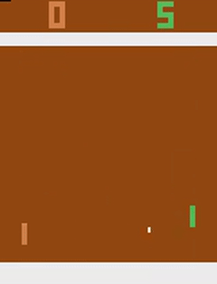
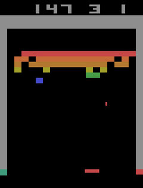

# Atari RL agent
Reinforcement learining based agents to playing atari games.

## Agents
- Deep Q-network(DQN)
  - Double DQN
  - Prioritized Replay
  - Dueiling network
- Asynchronous Advantage Actor-Critic(A3C)

## Test pretrained Agent
```
usage: evaluate.py [-h] [-e ENVIRONMENT] -c CHECKPOINT [--dueling] [-v VIDEO]

optional arguments:
  -h, --help            show this help message and exit
  -e ENVIRONMENT, --environment ENVIRONMENT
                        envirement to play
  -c CHECKPOINT, --checkpoint CHECKPOINT
                        checkpoint for agent
  --dueling             enable dueling dqn
  -v VIDEO, --video VIDEO
                        videos_dir
```
Example: 
- PongDeterministic-v4 
  ```
  python evaluate.py -c ckpt/PongDeterministic_deuling_972500.pth --dueling -e PongDeterministic-v4
  ```
- BreakoutDeterministic-v4
  ```
  python evaluate.py -c ckpt/BreakoutDeterministic_deuling_3560000.pth --dueling -e BreakoutDeterministic-v4
  ```

## Game Play





## Train Agent
``` 
usage: train.py [-h] [-e ENVIRONMENT] [-l LOG_DIR] [-t TRAIN_DIR]
                [-c CHECKPOINT] [--double_dqn] [--dueling] [--priority_replay]
                [--replay_size REPLAY_SIZE] [--tpu] [--batch_size BATCH_SIZE]
                [--init_epsilon INIT_EPSILON] [--final_epsilon FINAL_EPSILON]
                [--lr LR] [--max_grad_norm MAX_GRAD_NORM] [--gamma GAMMA]
                [--steps STEPS] [--loss_freq LOSS_FREQ]
                [--target_freq TARGET_FREQ] [--eval_freq EVAL_FREQ]

optional arguments:
  -h, --help            show this help message and exit
  -e ENVIRONMENT, --environment ENVIRONMENT
                        Envirement to play
  -l LOG_DIR, --log_dir LOG_DIR
                        Logs dir for tensorboard
  -t TRAIN_DIR, --train_dir TRAIN_DIR
                        Checkpoint directory
  -c CHECKPOINT, --checkpoint CHECKPOINT
                        Checkpoint for agent
  --double_dqn          Enable double_dqn
  --dueling             Enable dueling dqn
  --priority_replay     Enable priority replay
  --replay_size REPLAY_SIZE
                        Replay buffer size
  --tpu                 Enable TPU
  --batch_size BATCH_SIZE
                        Batch size for training
  --init_epsilon INIT_EPSILON
                        Intial value of epsilon
  --final_epsilon FINAL_EPSILON
                        Final value of epsilon
  --lr LR               Learning Rate
  --max_grad_norm MAX_GRAD_NORM
                        Gradient clipping
  --gamma GAMMA         Discounting factor
  --steps STEPS         Training steps
  --loss_freq LOSS_FREQ
                        loss frequency
  --target_freq TARGET_FREQ
                        Target network update frequency
  --eval_freq EVAL_FREQ
                        Evalualtion frequency
```

## Supported Environment
- [x] BreakoutDeterministic-v4
- [x] PongDeterministic-v4
- [x] KungFuMasterDeterministic-v4

## TODO
- [x] DQN
- [x] TensorBoard support
- [x] Double DQN
- [x] Prioritized replay
- [x] Dueling network
- [X] Train model for Pong
- [x] Achive 300+ score on breakout
- [x] A3C Agent for KungFuMasterDeterministic-v4
- [ ] Parallel processing for A3C

## References
- https://github.com/yandexdataschool/Practical_RL
- https://github.com/openai/baselines/blob/master/baselines/deepq/replay_buffer.py
- https://towardsdatascience.com/tutorial-double-deep-q-learning-with-dueling-network-architectures-4c1b3fb7f756

