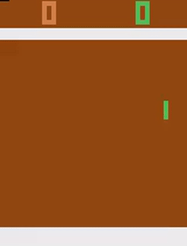

# Atari RL agent
Reinforcement learining based agents to playing atari games.

## Agents
- DQN
- Double DQN
- Prioritized Replay
- Dueiling network

## Test pretrained Agent
- PongDeterministic-v4 
  ```
  python evaluate.py -c ckpt/PongDeterministic_deuling_972500.pth --dueling -e PongDeterministic-v4
  ```
- BreakoutDeterministic-v4
  ```
  python evaluate.py -c ckpt/BreakoutDeterministic_deuling_3560000.pth --dueling -e BreakoutDeterministic-v4
  ```

## Game Play




## Supported Environment
- [x] BreakoutDeterministic-v4
- [x] PongDeterministic-v4

## TODO
- [x] DQN
- [x] TensorBoard support
- [x] Double DQN
- [x] Prioritized replay
- [x] Dueling network
- [X] Train model for Pong
- [x] Achive 300+ score on breakout

## References
- https://github.com/yandexdataschool/Practical_RL
- https://github.com/openai/baselines/blob/master/baselines/deepq/replay_buffer.py
- https://towardsdatascience.com/tutorial-double-deep-q-learning-with-dueling-network-architectures-4c1b3fb7f756

